<!-- Generated by astro.config.mjs on every build. Do not edit by hand. -->
# Asset library

20 catalogued photographs. Templates request these by intent —
`findAssets({ cls: 'camping', ratio: '16:9' })` — never by path, so a slot cannot be
filled by whatever happened to be lying in `public/images/`.

An empty result renders nothing. That is correct behaviour, not a bug to paper over.

- **Originals** live in `assets/originals/`. Three exceed 5 MB and are gitignored;
  `assets/README.md` says where they are kept.
- **Derivatives** are generated by `node assets/build-derivatives.mjs` and committed.
- **Constraints** are enforced by `tests/assets.test.mjs`, not by convention.

## camping (2)

### `camp-pouch-rehydrated-chili`

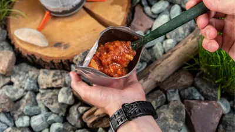

| | |
|---|---|
| Alt | Hands holding an open silver pouch of rehydrated chilli beside a camp stove on a bed of river rock. |
| Source | `stock` |
| Credit | Stock photo — not Sublime Pantry packaging |
| Ratios | `16:9`, `4:5`, `1:1` |
| Intrinsic | 6120×4084 |
| Widths | 16:9: 400/800/1600 · 4:5: 400/800/1600 · 1:1: 400/800/1600 |
| Subject | `camping`, `trail`, `pouch`, `meal`, `rehydration` |
| Restrictions | `not-product-imagery`, `editorial-illustration-only` |
| Used by | *unplaced* |

### `camp-pouch-freeze-dried-vegetables`

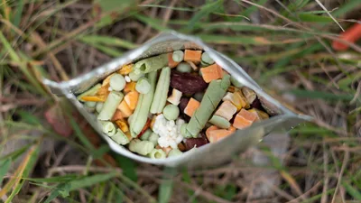

| | |
|---|---|
| Alt | An open silver pouch of freeze-dried green beans, peas, sweetcorn and diced carrot resting in dry grass. |
| Source | `stock` |
| Credit | Stock photo — not Sublime Pantry packaging |
| Ratios | `16:9`, `4:5`, `1:1` |
| Intrinsic | 6016×4000 |
| Widths | 16:9: 400/800/1600 · 4:5: 400/800/1600 · 1:1: 400/800/1600 |
| Subject | `camping`, `trail`, `pouch`, `vegetables` |
| Restrictions | `not-product-imagery`, `editorial-illustration-only` |
| Used by | *unplaced* |

## equipment (2)

### `freeze-dryer-door-trays-fruit`

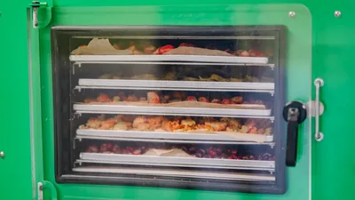

| | |
|---|---|
| Alt | The clear inner door of a green home freeze dryer, closed over five stacked trays of part-dried fruit. |
| Source | `stock` |
| Credit | Stock photo — not a Sublime Pantry test unit |
| Ratios | `16:9`, `4:5`, `1:1` |
| Intrinsic | 6000×4000 |
| Widths | 16:9: 400/800/1600 · 4:5: 400/800/1600 · 1:1: 400/800/1600 |
| Subject | `freeze-dryer`, `chamber`, `trays`, `fruit`, `machines` |
| Restrictions | `not-our-equipment` |
| Used by | article: which-freeze-dryer |

### `freeze-dryer-pair-loaded-trays`

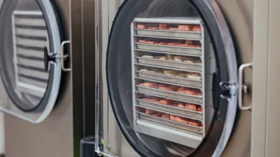

| | |
|---|---|
| Alt | Two home freeze dryers side by side, one with its chamber door open on eight stacked trays of part-dried red fruit. |
| Source | `stock` |
| Credit | Stock photo — not a Sublime Pantry test unit |
| Ratios | `16:9`, `4:5`, `1:1` |
| Intrinsic | 3845×5767 |
| Widths | 16:9: 400/800/1600 · 4:5: 400/800/1600 · 1:1: 400/800/1600 |
| Subject | `freeze-dryer`, `vacuum-pump`, `trays`, `fruit`, `machines` |
| Restrictions | `not-our-equipment` |
| Used by | article: home-freeze-dryers |

## food (3)

### `freeze-dried-strawberry-slices-pile`

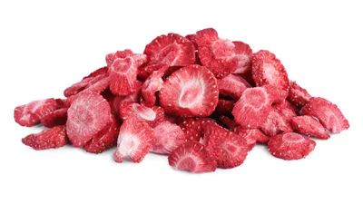

| | |
|---|---|
| Alt | A pile of freeze-dried strawberry slices on white, cut faces showing pale dry centres and visible seeds. |
| Source | `stock` |
| Credit | Stock photo |
| Ratios | `16:9`, `4:5`, `1:1` |
| Intrinsic | 2850×1272 |
| Widths | 16:9: 400/800/1600 · 4:5: 400/800/1600 · 1:1: 400/800/1600 |
| Subject | `strawberry`, `fruit` |
| Restrictions | `provenance-unverified` |
| Used by | *unplaced* |

### `freeze-dried-blueberries-pile`

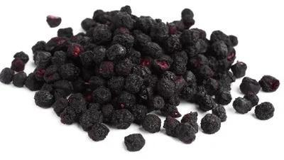

| | |
|---|---|
| Alt | A pile of whole freeze-dried blueberries on white, skins wrinkled and matte with occasional split red interiors. |
| Source | `stock` |
| Credit | Stock photo |
| Ratios | `16:9`, `4:5`, `1:1` |
| Intrinsic | 2327×1214 |
| Widths | 16:9: 400/800/1600 · 4:5: 400/800/1600 · 1:1: 400/800/1600 |
| Subject | `blueberry`, `fruit` |
| Restrictions | `provenance-unverified` |
| Used by | *unplaced* |

### `freeze-dried-banana-slices-pile`

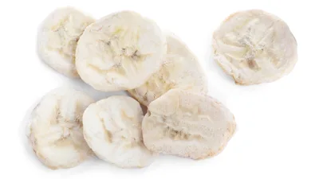

| | |
|---|---|
| Alt | Seven freeze-dried banana slices on white, pale and chalky with the seed line still visible across each cut face. |
| Source | `stock` |
| Credit | Stock photo |
| Ratios | `16:9`, `4:5`, `1:1` |
| Intrinsic | 2101×1265 |
| Widths | 16:9: 400/800/1600 · 4:5: 400/800/1600 · 1:1: 400/800/1600 |
| Subject | `banana`, `fruit` |
| Restrictions | `provenance-unverified` |
| Used by | *unplaced* |

## product (13)

### `packfresh-6x6-bag-100cc-absorbers`

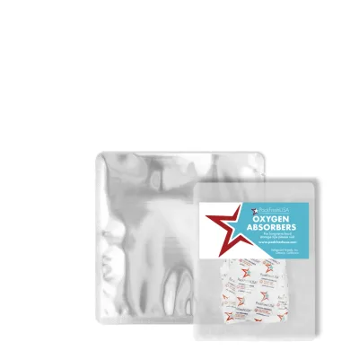

| | |
|---|---|
| Alt | A 6 by 6 inch flat Mylar bag with rounded corners beside a sealed pack of PackFreshUSA 100cc oxygen absorbers. |
| Source | `manufacturer` |
| Credit | Photo: PackFreshUSA |
| Ratios | `1:1` |
| Intrinsic | 1280×1280 |
| Widths | 1:1: 400/800 |
| Subject | `mylar-bag`, `6x6`, `oxygen-absorber`, `100cc`, `snack`, `SP-SNK-KIT` |
| Restrictions | — |
| Used by | product: SP-SNK-50 product: SP-SNK-100 product: SP-BUNDLE-STARTER product: SP-BUNDLE-SEASON |

### `packfresh-6x6-bag-dimensions`

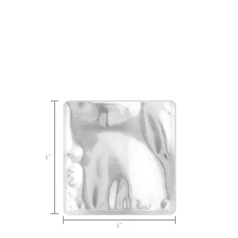

| | |
|---|---|
| Alt | A 6 by 6 inch flat Mylar bag with its width and height dimensioned at 6 inches on each side. |
| Source | `manufacturer` |
| Credit | Photo: PackFreshUSA |
| Ratios | `1:1` |
| Intrinsic | 1280×1280 |
| Widths | 1:1: 400/800 |
| Subject | `mylar-bag`, `6x6`, `dimensions`, `snack`, `SP-SNK-KIT` |
| Restrictions | — |
| Used by | product: SP-SNK-50 product: SP-SNK-100 product: SP-BUNDLE-STARTER product: SP-BUNDLE-SEASON |

### `packfresh-mre-half-front`

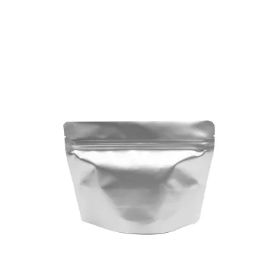

| | |
|---|---|
| Alt | A half-portion 7.5 mil MRE stand-up Mylar pouch, zipper closed, seen from the front. |
| Source | `manufacturer` |
| Credit | Photo: PackFreshUSA |
| Ratios | `1:1` |
| Intrinsic | 1280×1280 |
| Widths | 1:1: 400/800 |
| Subject | `mre-pouch`, `half-portion`, `7.5mil`, `trail`, `SP-TRL-HALF` |
| Restrictions | — |
| Used by | *unplaced* |

### `packfresh-mre-half-with-absorbers`

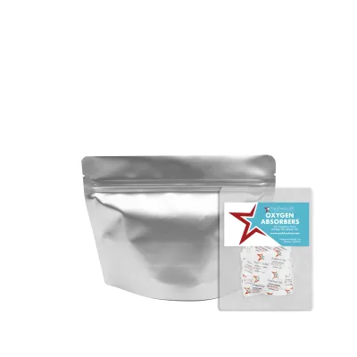

| | |
|---|---|
| Alt | A half-portion 7.5 mil MRE stand-up Mylar pouch beside a sealed pack of PackFreshUSA oxygen absorbers. |
| Source | `manufacturer` |
| Credit | Photo: PackFreshUSA |
| Ratios | `1:1` |
| Intrinsic | 1280×1280 |
| Widths | 1:1: 400/800 |
| Subject | `mre-pouch`, `half-portion`, `oxygen-absorber`, `trail`, `SP-TRL-HALF` |
| Restrictions | — |
| Used by | *unplaced* |

### `packfresh-mre-half-open-interior`

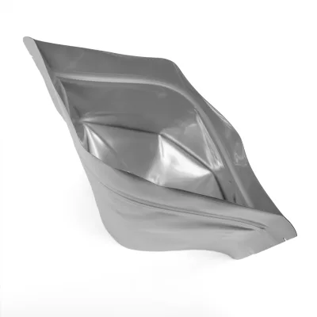

| | |
|---|---|
| Alt | A half-portion MRE Mylar pouch held open, showing the unprinted silver interior and the bottom gusset. |
| Source | `manufacturer` |
| Credit | Photo: PackFreshUSA |
| Ratios | `1:1` |
| Intrinsic | 1280×1280 |
| Widths | 1:1: 400/800 |
| Subject | `mre-pouch`, `half-portion`, `interior`, `trail`, `SP-TRL-HALF` |
| Restrictions | — |
| Used by | *unplaced* |

### `packfresh-mre-half-dimensions`

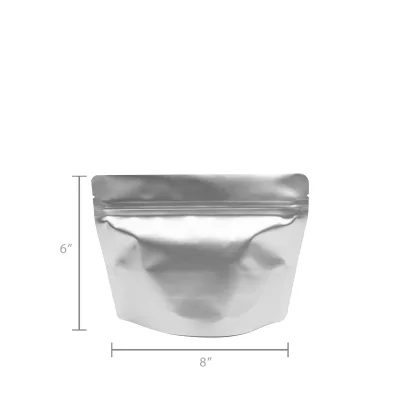

| | |
|---|---|
| Alt | A half-portion MRE stand-up Mylar pouch dimensioned at 6 inches tall by 8 inches wide. |
| Source | `manufacturer` |
| Credit | Photo: PackFreshUSA |
| Ratios | `1:1` |
| Intrinsic | 1280×1280 |
| Widths | 1:1: 400/800 |
| Subject | `mre-pouch`, `half-portion`, `dimensions`, `trail`, `SP-TRL-HALF` |
| Restrictions | — |
| Used by | *unplaced* |

### `packfresh-mre-full-with-absorbers`

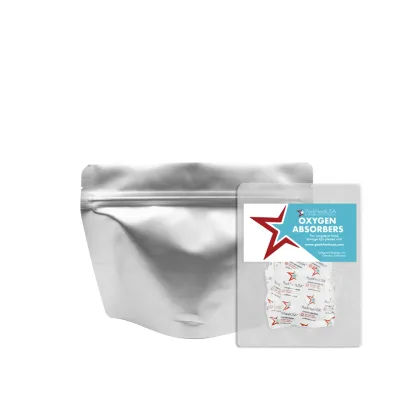

| | |
|---|---|
| Alt | A full-portion 7.5 mil MRE stand-up Mylar pouch beside a sealed pack of PackFreshUSA oxygen absorbers. |
| Source | `manufacturer` |
| Credit | Photo: PackFreshUSA |
| Ratios | `1:1` |
| Intrinsic | 1280×1280 |
| Widths | 1:1: 400/800 |
| Subject | `mre-pouch`, `full-portion`, `oxygen-absorber`, `trail`, `SP-TRL-FULL` |
| Restrictions | — |
| Used by | *unplaced* |

### `packfresh-mre-full-gusset-dimensions`

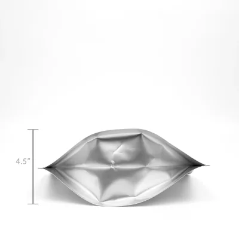

| | |
|---|---|
| Alt | A full-portion MRE Mylar pouch lying on its side, its bottom gusset dimensioned at 4.5 inches. |
| Source | `manufacturer` |
| Credit | Photo: PackFreshUSA |
| Ratios | `1:1` |
| Intrinsic | 1280×1280 |
| Widths | 1:1: 400/800 |
| Subject | `mre-pouch`, `full-portion`, `gusset`, `dimensions`, `trail`, `SP-TRL-FULL` |
| Restrictions | — |
| Used by | *unplaced* |

### `packfresh-quart-flat-with-absorbers`

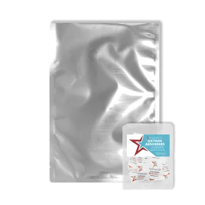

| | |
|---|---|
| Alt | A quart flat Mylar bag beside a sealed pack of PackFreshUSA oxygen absorbers. |
| Source | `manufacturer` |
| Credit | Photo: PackFreshUSA |
| Ratios | `1:1` |
| Intrinsic | 1280×1280 |
| Widths | 1:1: 400/800 |
| Subject | `mylar-bag`, `quart`, `oxygen-absorber`, `reserve`, `SP-RSV-QUART` |
| Restrictions | — |
| Used by | product: SP-QT-50 |

### `packfresh-quart-flat-dimensions`

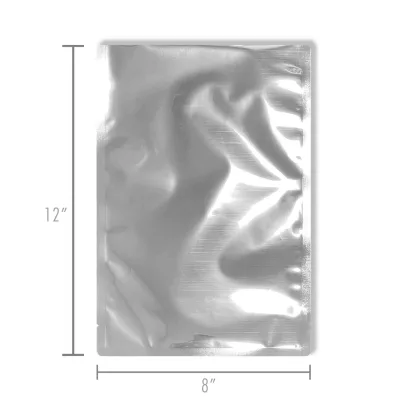

| | |
|---|---|
| Alt | A quart flat Mylar bag dimensioned at 12 inches tall by 8 inches wide. |
| Source | `manufacturer` |
| Credit | Photo: PackFreshUSA |
| Ratios | `1:1` |
| Intrinsic | 1280×1280 |
| Widths | 1:1: 400/800 |
| Subject | `mylar-bag`, `quart`, `dimensions`, `reserve`, `SP-RSV-QUART` |
| Restrictions | — |
| Used by | product: SP-QT-50 |

### `packfresh-mini-sealer-open`

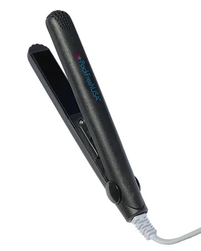

| | |
|---|---|
| Alt | A PackFreshUSA mini bag sealer standing upright with its jaws open and its cord trailing. |
| Source | `manufacturer` |
| Credit | Photo: PackFreshUSA |
| Ratios | `4:5` |
| Intrinsic | 1152×1280 |
| Widths | 4:5: 400/800 |
| Subject | `sealer`, `tool`, `SP-TOOL-SEALER` |
| Restrictions | — |
| Used by | product: SP-TOOL-HM150 product: SP-BUNDLE-STARTER product: SP-BUNDLE-SEASON |

### `packfresh-mini-sealer-angled`

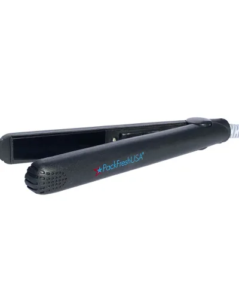

| | |
|---|---|
| Alt | A PackFreshUSA mini bag sealer seen at an angle, jaws open, showing the heating strip. |
| Source | `manufacturer` |
| Credit | Photo: PackFreshUSA |
| Ratios | `4:5` |
| Intrinsic | 1152×1280 |
| Widths | 4:5: 400/800 |
| Subject | `sealer`, `tool`, `SP-TOOL-SEALER` |
| Restrictions | — |
| Used by | product: SP-TOOL-HM150 product: SP-BUNDLE-STARTER product: SP-BUNDLE-SEASON |

### `packfresh-mini-sealer-sealing-bag`

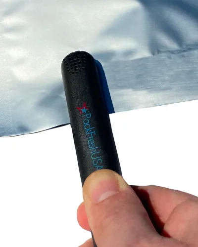

| | |
|---|---|
| Alt | A hand closing a PackFreshUSA mini bag sealer across the open top of a Mylar bag. |
| Source | `manufacturer` |
| Credit | Photo: PackFreshUSA |
| Ratios | `4:5` |
| Intrinsic | 1152×1280 |
| Widths | 4:5: 400/800 |
| Subject | `sealer`, `tool`, `sealing`, `SP-TOOL-SEALER` |
| Restrictions | — |
| Used by | product: SP-TOOL-HM150 product: SP-BUNDLE-STARTER product: SP-BUNDLE-SEASON |

## Classes with nothing in them

### `process`

`findAssets({ cls: 'process' })` returns `[]`. Any slot asking for one renders nothing.

**Empty pending photography we can actually take.** Packing, sealing and
labelling are what this site sells, and none of it needs a freeze dryer or a
face: sealing a Mylar bag with the impulse sealer, an absorber going into an
open bag, sealed and labelled bags in a storage bin, the 6×6 beside the quart
beside the gallon for scale, a sealed bag with the absorber indicator visible.
Those carry `source: 'own'` and no credit line. Store-bought freeze-dried
fruit in our own bags is honest for these — the subject is the packaging.
Shoot once the wholesale order lands.

### `line-hero`

`findAssets({ cls: 'line-hero' })` returns `[]`. Any slot asking for one renders nothing.

**Empty, and nothing here may be promoted into it.** The two camping frames
are stock photographs of somebody else's commercial pouches and carry
`not-product-imagery`. Using one as a line hero is precisely the failure that
restriction exists to prevent.

### `brand`

`findAssets({ cls: 'brand' })` returns `[]`. Any slot asking for one renders nothing.

**Empty by decision, not by omission.** Sublime Pantry is an institutional
publication, not a personal one: credibility rests on stated criteria, dated
sourcing, published corrections and a re-check schedule — not on a face or a
founder story. There is no portrait slot to fill, and this class should stay
empty. If a wide brand frame is ever wanted for the homepage, sealed and
labelled bags on a clean surface is the shot; a person is not.

## Provenance

Assets marked `provenance-unverified` arrived with their EXIF stripped and no licence
record. They are labelled `stock` / `Stock photo` because that is the conservative
reading, not because the source is known. If a licence record turns up, upgrade the
entry in `src/lib/assets.ts`.
